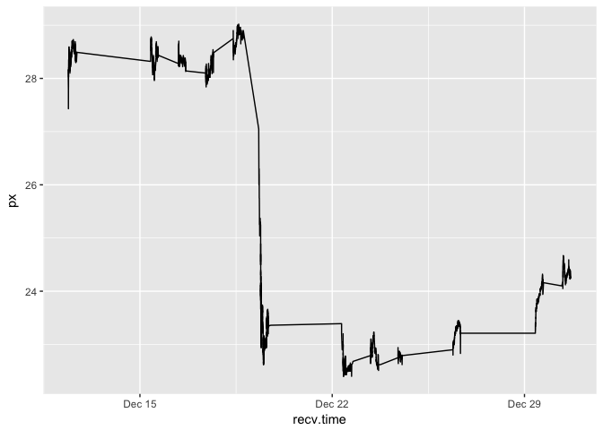
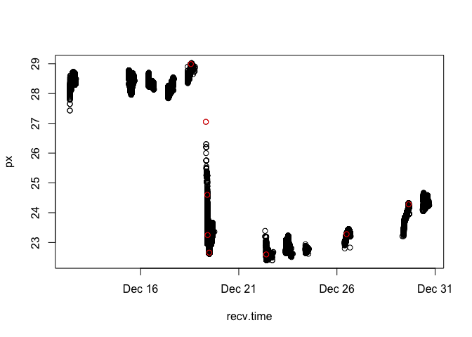
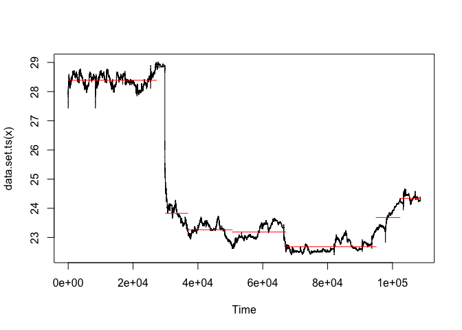
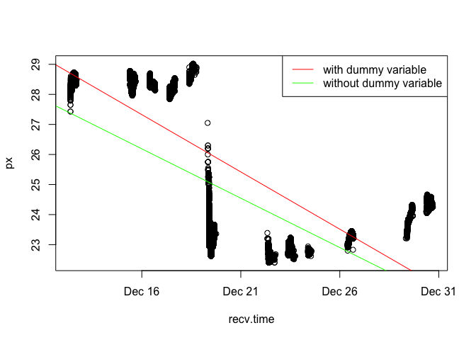

Phase one
================
Fan Gong
June 24, 2017

Preparation
===========

Set work directory and install packages

``` r
library(lubridate)
library(ggplot2)
library(changepoint)
library(tsoutliers)
load("/Users/gongfan/Desktop/byteflow/Stock Market/complete_dataset.RData")
```

First cycle
===========

``` r
#tail(rownames(df[df$date=="2014-12-30",]),1)
first_cycle <- df[1:108546,]
first_cycle$recv.time<- as.POSIXct(strptime(paste(first_cycle$date,first_cycle$recv.time),"%Y-%m-%d %H:%M:%S"))
ggplot(data = first_cycle, aes(x = recv.time,y = px)) + geom_line() 
```



method 1
--------

I use the number of change points to represent the trend difference.

``` r
mvalue_first <- cpt.mean(first_cycle$px, method="PELT")
changepoint_first <- first_cycle[cpts(mvalue_first),]
head(changepoint_first)
```

    ##           X           recv.time    px  shares exchange   bid bidsz   ask
    ## 27205  1797 2014-12-18 13:25:41 28.99  234491        D 28.98   400 29.00
    ## 29806     1 2014-12-19 07:47:32 27.05     100      N/A 27.05   100 27.50
    ## 30014   209 2014-12-19 09:30:05 24.60  204546        D 24.53   200 24.89
    ## 36856  7051 2014-12-19 09:55:55 23.25 1527545        Q 23.26   100 23.28
    ## 50599 20794 2014-12-19 11:56:27 22.66 3882714        D 22.66   200 22.67
    ## 67047   553 2014-12-22 09:34:41 22.60  151269        D 22.60  1000 22.61
    ##       asksz       date   type
    ## 27205   200 2014-12-18    ref
    ## 29806   500 2014-12-19 signal
    ## 30014   200 2014-12-19 signal
    ## 36856   200 2014-12-19 signal
    ## 50599   800 2014-12-19 signal
    ## 67047   600 2014-12-22 normal

``` r
plot(px~recv.time, data = first_cycle)
points(x=changepoint_first$recv.time, y=changepoint_first$px, col='red')
```



``` r
plot(mvalue_first)
```



*The result shows that during the signal day, it always has more change points.*

method 2
--------

I use the significance of dummy variable to show that there must be some trend differences between normal days and signal days.

### method 2 model

``` r
first_cycle$sig <- "no"
first_cycle[first_cycle$date == "2014-12-19","sig"] <- "yes"
first_cycle$sig <- as.factor(first_cycle$sig)
lm1 <- lm(px~recv.time + sig, data = first_cycle) 
summary(lm1)
```

    ## 
    ## Call:
    ## lm(formula = px ~ recv.time + sig, data = first_cycle)
    ## 
    ## Residuals:
    ##     Min      1Q  Median      3Q     Max 
    ## -2.4796 -1.2303  0.0097  1.0336  3.6299 
    ## 
    ## Coefficients:
    ##               Estimate Std. Error t value Pr(>|t|)    
    ## (Intercept)  6.290e+03  1.618e+01   388.7   <2e-16 ***
    ## recv.time   -4.414e-06  1.140e-08  -387.1   <2e-16 ***
    ## sigyes      -2.637e+00  9.270e-03  -284.5   <2e-16 ***
    ## ---
    ## Signif. codes:  0 '***' 0.001 '**' 0.01 '*' 0.05 '.' 0.1 ' ' 1
    ## 
    ## Residual standard error: 1.419 on 108543 degrees of freedom
    ## Multiple R-squared:  0.644,  Adjusted R-squared:  0.644 
    ## F-statistic: 9.818e+04 on 2 and 108543 DF,  p-value: < 2.2e-16

``` r
lm_without_dummy <- lm(px~recv.time, data = first_cycle)

plot(px~recv.time, data = first_cycle)
abline(lm1, col = "red")
abline(lm_without_dummy, col = "green")
legend("topright", legend = c('with dummy variable', 'without dummy variable'), col = c('red','green'), lty = 1)
```



### method 2 robust test

suppose we randomly choose 10000 data points as signal days' data to test now whether or not the dummy variable is significant. The reason I choose 10000 is because the signal day has 30000+ data.

``` r
random_row <- base::sample(1:nrow(first_cycle), size = 10000)
first_cycle$sig <- "no"
first_cycle[random_row,"sig"] <- "yes"
first_cycle$sig <- as.factor(first_cycle$sig)
lm_robust <- lm(px~recv.time +sig, data = first_cycle)
summary(lm_robust)
```

    ## 
    ## Call:
    ## lm(formula = px ~ recv.time + sig, data = first_cycle)
    ## 
    ## Residuals:
    ##     Min      1Q  Median      3Q     Max 
    ## -2.4185 -1.5578 -0.9709  2.1012  3.6850 
    ## 
    ## Coefficients:
    ##               Estimate Std. Error  t value Pr(>|t|)    
    ## (Intercept)  5.425e+03  2.100e+01  258.306   <2e-16 ***
    ## recv.time   -3.805e-06  1.480e-08 -257.132   <2e-16 ***
    ## sigyes      -2.260e-03  1.968e-02   -0.115    0.909    
    ## ---
    ## Signif. codes:  0 '***' 0.001 '**' 0.01 '*' 0.05 '.' 0.1 ' ' 1
    ## 
    ## Residual standard error: 1.875 on 108543 degrees of freedom
    ## Multiple R-squared:  0.3785, Adjusted R-squared:  0.3785 
    ## F-statistic: 3.306e+04 on 2 and 108543 DF,  p-value: < 2.2e-16

*the output obviously shows that now the dummy variable is not statistical significant*
