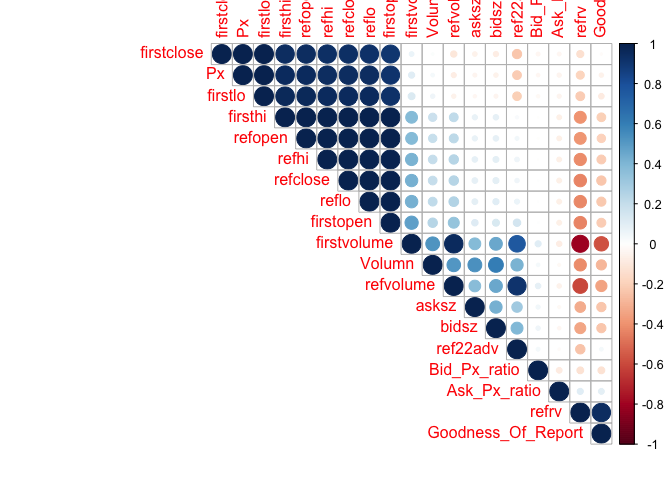

Phase two
================
Fan Gong
2017/8/4

Predictive Model for Stock Market
=================================

-   **Preview**: We have already proved that there is a pattern on signal dates that doesn't appear on other normal dates. Therefore, in second phase, I try to create a predictive model to simulate this oscillation pattern and make a prediction.

-   **Goal**: Aim to make the test error as small as possible

1. Data Loading
---------------

First let us focus on one **important ticker**. *The important tickers are the ones with high market capitalizations*, which can be approximated by multiplying the average daily volume (ref22adv field) by the close price prior to the report. Among all the tickers we have, the \#17th ticker has the highest market capitalization, so I will focus on that ticker for analysis.

For the \#17th ticker, we have four complete signal days' data totally. Then, I divide our data set into three part, training set contains first three signal day's data and 20% fourth signal day's data. The cross-validation set contains the middle 40% fourth signal day's data and the testing set contains the last 40% fourth signal day's data. *The reason to include 20% fourth signal day's data into the training set is because even if there is a similar pattern among all signal dates, every signal day has its own unique pattern. So it is necessary to have 20% fourth signal day's data included in our training set to fully train our model.*

``` r
load("/Users/gongfan/Desktop/byteflow/Stock Market/shiqi.RData")
head(shiqi)
```

    ##                                  id Response       Px AMC_BMO Bid_Px_ratio
    ## 2 17_2015-01-09 2015-01-09 08:19:30     Down 150.0929       1    0.9999473
    ## 3 17_2015-01-09 2015-01-09 08:19:40     Down 150.0800       1    0.9994781
    ## 4 17_2015-01-09 2015-01-09 08:19:50       Up 150.0100       1    1.0000000
    ## 5 17_2015-01-09 2015-01-09 08:20:00     Down 150.1667       1    0.9990011
    ## 6 17_2015-01-09 2015-01-09 08:20:10       Up 150.0850       1    0.9982343
    ## 7 17_2015-01-09 2015-01-09 08:20:20     Down 150.1729       1    0.9991534
    ##   Ask_Px_ratio Volumn Goodness_Of_Report    refrv ref22adv refvolume
    ## 2     1.001194   2760        0.003521127 0.287086   270118    526700
    ## 3     1.000722    688        0.003521127 0.287086   270118    526700
    ## 4     1.001200    200        0.003521127 0.287086   270118    526700
    ## 5     1.000821    555        0.003521127 0.287086   270118    526700
    ## 6     1.000366    244        0.003521127 0.287086   270118    526700
    ## 7     1.000571    900        0.003521127 0.287086   270118    526700
    ##   refopen  refhi  reflo refclose firstvolume firstopen firsthi firstlo
    ## 2  138.95 142.28 138.01      142     1142800    151.32  154.73  148.98
    ## 3  138.95 142.28 138.01      142     1142800    151.32  154.73  148.98
    ## 4  138.95 142.28 138.01      142     1142800    151.32  154.73  148.98
    ## 5  138.95 142.28 138.01      142     1142800    151.32  154.73  148.98
    ## 6  138.95 142.28 138.01      142     1142800    151.32  154.73  148.98
    ## 7  138.95 142.28 138.01      142     1142800    151.32  154.73  148.98
    ##   firstclose bidsz asksz last_px_diff
    ## 2      151.5  2800  2700           Up
    ## 3      151.5   600   600         Down
    ## 4      151.5   200   100         Down
    ## 5      151.5   500   400           Up
    ## 6      151.5   200   400         Down
    ## 7      151.5   700   700           Up

``` r
#delete unrelated variables
df = shiqi %>% select(-c(1, 4, 23))

#Training set
n_fourth = nrow(df) - 8600 + 1
train = df[1:(8600 + 0.2 * n_fourth), ]

#Cross-validation set
CV = df[(8600 + 0.2 * n_fourth + 1):(8600 + 0.6 * n_fourth), ]

#Testing set
test = df[(8600 + 0.6 * n_fourth + 1):nrow(df), ]
```

2. Feature Engineering
----------------------

### 2.1 Correlation Matrix

First I plot the **correlation matrix** to see whether each pair of variables are correlated or not.

We could easily see that `refopen`, `refhi`, `reflo`, `refclose`, `firstopen`, `firsthi`, `firstlo`, `firstclose`, `Px` these nine variables are highly correlated. By looking at the detailed information about these variables, we find that not only they are very close to each other, but also each variable has only four unique values (except for `Px`) which makes little sense to include all of them.

``` r
no_factor_df = df %>% select(-1) %>% as.matrix()
corr.matrix = cor(no_factor_df)
corrplot(corr.matrix, type = "upper", order = "AOE")
```



### 2.2 Histograms and Boxplots

Then I try to make some **bar plots** and **box plots** to see whether each variable has a great impact on our response. *If this variable has a great impact on the response, we could expect that the distribution in each group will be different.*

``` r
newdata = df %>% melt(id = "Response")

#One plot is too small to see the detailed information, so I make four plots.
part1 = df %>% select(1:6) %>% melt(id = "Response")
bar1 = ggplot(data = part1) +
  geom_histogram(aes(x = value, color = Response), bins = 10, position = "dodge") +
  facet_grid(.~variable, scales = "free") 
box1 = ggplot(data = part1) + 
  geom_boxplot(aes(x = Response, y = value)) +
  facet_grid(.~variable, scales = "free")
grid.arrange(bar1, box1, nrow = 2, ncol = 1)
```


``` r
part2 = df %>% select(c(1,7:11)) %>% melt(id = "Response")
bar2 = ggplot(data = part2) +
  geom_histogram(aes(x = value, color = Response), bins = 10, position = "dodge") +
  facet_grid(.~variable, scales = "free")
box2 = ggplot(data = part2) + 
  geom_boxplot(aes(x = Response, y = value)) +
  facet_grid(.~variable, scales = "free")
grid.arrange(bar2, box2, nrow = 2, ncol = 1)
```


``` r
part3 = df %>% select(c(1,12:16)) %>% melt(id = "Response")
bar3 = ggplot(data = part3) +
  geom_histogram(aes(x = value, color = Response), bins = 10, position = "dodge") +
  facet_grid(.~variable, scales = "free")
box3 = ggplot(data = part3) + 
  geom_boxplot(aes(x = Response, y = value)) +
  facet_grid(.~variable, scales = "free")
grid.arrange(bar3, box3, nrow = 2, ncol = 1)
```


``` r
part4 = df %>% select(c(1, 17:20)) %>% melt(id = "Response")
bar4 = ggplot(data = part4) +
  geom_histogram(aes(x = value, color = Response), bins = 10, position = "dodge") +
  facet_grid(.~variable, scales = "free")
box4 = ggplot(data = part4) + 
  geom_boxplot(aes(x = Response, y = value)) +
  facet_grid(.~variable, scales = "free")
grid.arrange(bar4, box4, nrow = 2, ncol = 1)
```


Through seeing these plots, I find that:

-   `refopen`, `refhi`, `reflo`, `refclose`, `firstopen`, `firsthi`, `firstlo`, `firstclose`, `refrv` has little impact on Response, so it is better to remove all of them. Instead, `Px` is correlated with them and has some impact on the Response, so it is better to include it.

-   `Bid_Px_ratio`, `Ask_Px_ratio` are generated by `bidsz` and `asksz`, and the value of them has little difference in each group. Therefore it is also better to remove them.

-   `Volumn`, `bidsz`, `asksz` are good predictors.

-   `ref22adv`, `refvolume`, `firstvolume` in some sense have influence on reponse, but the impact is very weak.

-   `Goodness_Of_Report` is a useful predictor to quantify the report but it seems like the value we generated here is not that useful.

### 2.3 Conclusion

**In general**,

1.  The predictor must be included: `Volumn`, `bidsz`, `asksz`, `Px`

2.  The predictor may be included: `ref22adv`, `refvolume`, `firstvolume`, `Goodness_Of_Report`

3.  The predictor will not be included: `refopen`, `refhi`, `reflo`, `refclose`, `firstopen`, `firsthi`, `firstlo`, `firstclose`, `refrv`, `Bid_Px_ratio`, `Ask_Px_ratio`

3. Model Training
-----------------

### 3.1 Support Vector Machine with all the predictors

In machine learning, **support vector machines** (SVMs) are supervised learning models with associated learning algorithms that analyze data used for classification and regression analysis. SVMs can efficiently perform a non-linear classification using what is called the kernel trick, implicitly mapping their inputs into high-dimensional feature spaces.

So, at first I use all predictors with three different kernels to perform support vector machine.

We see that the third model with 'radial basis' kernel performs best.

``` r
set.seed(1)

#Construct function to find the best tuning parameter in SVM
optimal_param = function(cost, gamma, kernel){
  #cost is a vector contains all the cost value we want to tune
  #gamma is a vector contains all the gamma vaue we want to tune 
  #kernel is a charactor string contains the kernel name 
  record = data.frame(cost = NA, gamma = NA, accuracy = NA)
  index = 0
  
  for(i in cost){
    for(j in gamma){
      index = index + 1
      svm.out = svm(Response~., data = train, kernel = kernel, cost = i, gamma = j)
      ypred = predict(svm.out, CV)
      accuracy = mean(ypred == CV$Response)
      record[index,] = c(i,j,accuracy) 
    }
  }
  return(record)
} 


#Try linear kernel
result1 = optimal_param(c(0.1,1), gamma = c(2,5,7), "linear")
result1
```

    ##   cost gamma  accuracy
    ## 1  0.1     2 0.5817942
    ## 2  0.1     5 0.5817942
    ## 3  0.1     7 0.5817942
    ## 4  1.0     2 0.6741425
    ## 5  1.0     5 0.6741425
    ## 6  1.0     7 0.6741425

``` r
#Try sigmoid kernel
result2 = optimal_param(c(0.1,1), gamma = c(2,5,7), "sigmoid")
result2
```

    ##   cost gamma  accuracy
    ## 1  0.1     2 0.4828496
    ## 2  0.1     5 0.4881266
    ## 3  0.1     7 0.4881266
    ## 4  1.0     2 0.4815303
    ## 5  1.0     5 0.4881266
    ## 6  1.0     7 0.4907652

``` r
#Try radial basis kernel
result3 = optimal_param(c(0.1,1), gamma = c(2,7,9), "radial")
result3
```

    ##   cost gamma  accuracy
    ## 1  0.1     2 0.6253298
    ## 2  0.1     7 0.7137203
    ## 3  0.1     9 0.7440633
    ## 4  1.0     2 0.7189974
    ## 5  1.0     7 0.8443272
    ## 6  1.0     9 0.8390501

``` r
#Calculate the test accuracy
svm.final = svm(Response~., data = train, gamma = 7, cost = 1, kernel = "radial")
ypred = predict(svm.final, test)
mean(test$Response == ypred)
```

    ## [1] 0.7305152

### 3.2 Support Vector Machine with some of the predictors

Then I try to delete some of the predictors to improve the model. First I delete those most unlikely predictors which are `refopen`, `refhi`, `reflo`, `refclose`, `firstopen`, `firsthi`, `firstlo`, `firstclose`, `refrv`, `Bid_Px_ratio`, `Ask_Px_ratio`.

We could see that the model behave better than the model when we use all the variables.

``` r
df_1 = shiqi %>% select(-c(id, AMC_BMO, last_px_diff, refopen, refhi, reflo, refclose, 
                           firstopen, firsthi, firstlo, firstclose, refrv, Bid_Px_ratio, Ask_Px_ratio))

n_fourth = nrow(df_1) - 8600 + 1
#Training set
train = df_1[1:(8600 + 0.2 * n_fourth), ]
#Cross-validation set
CV = df_1[(8600 + 0.2 * n_fourth + 1):(8600 + 0.6 * n_fourth), ]
#Testing set
test = df_1[(8600 + 0.6 * n_fourth + 1):nrow(df_1), ]

#Train the model
svm.final = svm(Response~., data = train, gamma = 7, cost = 1, kernel = "radial")
ypred = predict(svm.final, test)
#Test accuracy
mean(test$Response == ypred)
```

    ## [1] 0.7437252

Then, I try to delete some of the uncertain variables which are `ref22adv`, `refvolume`, `firstvolume`. It seems like the accuracy is lower, so we will keep them.

``` r
df_2 = shiqi %>% select(-c(id, AMC_BMO, last_px_diff, refopen, refhi, reflo, refclose, firstopen, 
                           firsthi, firstlo, firstclose, refrv, Bid_Px_ratio, Ask_Px_ratio,ref22adv,refvolume,firstvolume))

n_fourth = nrow(df_2) - 8600 + 1
#Training set
train = df_2[1:(8600 + 0.2 * n_fourth), ]
#Testing set
test = df_2[(8600 + 0.6 * n_fourth + 1):nrow(df_2), ]

#Train the model
svm.final = svm(Response~., data = train, gamma = 7, cost = 1, kernel = "radial")
ypred = predict(svm.final, test)
#Test accuracy
mean(test$Response == ypred)
```

    ## [1] 0.7357992

4. Principal Component Analysis
-------------------------------

### 4.1 Generate Principal Components

**Principal component analysis** (PCA) is a statistical procedure that uses an orthogonal transformation to convert a set of observations of possibly correlated variables into a set of values of linearly uncorrelated variables called principal components.

From the correlation matrix part, we have already seen that there are some correlations within some predictors. In that case, it is reasonabel to perform Principal Component Analysis to do dimension reduction.

``` r
df_pca = df %>% select(-Response)

pca_train_df = df_pca[1:8979,]
pca_cv_df = df_pca[(8600 + 0.6 * n_fourth + 1):nrow(df),]

pr.out1 = prcomp(pca_train_df, scale = T)

#To see how many PCs we should choose
summary(pr.out1)
```

    ## Importance of components:
    ##                           PC1    PC2     PC3    PC4    PC5     PC6     PC7
    ## Standard deviation     3.0828 1.8947 1.36763 1.0325 1.0111 0.95513 0.80091
    ## Proportion of Variance 0.5002 0.1889 0.09844 0.0561 0.0538 0.04801 0.03376
    ## Cumulative Proportion  0.5002 0.6891 0.78758 0.8437 0.8975 0.94550 0.97927
    ##                           PC8     PC9      PC10      PC11      PC12
    ## Standard deviation     0.6256 0.05110 1.552e-14 5.987e-15 3.448e-15
    ## Proportion of Variance 0.0206 0.00014 0.000e+00 0.000e+00 0.000e+00
    ## Cumulative Proportion  0.9999 1.00000 1.000e+00 1.000e+00 1.000e+00
    ##                             PC13      PC14      PC15     PC16     PC17
    ## Standard deviation     1.027e-15 5.943e-16 3.108e-16 1.86e-16 5.99e-17
    ## Proportion of Variance 0.000e+00 0.000e+00 0.000e+00 0.00e+00 0.00e+00
    ## Cumulative Proportion  1.000e+00 1.000e+00 1.000e+00 1.00e+00 1.00e+00
    ##                            PC18     PC19
    ## Standard deviation     5.79e-17 5.62e-17
    ## Proportion of Variance 0.00e+00 0.00e+00
    ## Cumulative Proportion  1.00e+00 1.00e+00

``` r
#new training set
feature_train = pr.out1$x[,1:5]
feature_train = data.frame(cbind(feature_train, Response = train$Response))
feature_train$Response = factor(feature_train$Response, levels = c(1,2,3))

#new testing set
feature_cv = predict(pr.out1, pca_cv_df)[,1:5]
feature_cv = data.frame(cbind(feature_cv, Response = test$Response))
feature_cv$Response = factor(feature_cv$Response, levels = c(1,2,3))
```

### 4.2 Support Vector Machine with PCA

After obtained the new training set and testing set based on principal components, I then perform SVM by using the best model selected from the model training part. It seems like the accuracy is lower than before, that maybe because the feature dimension is not very large and also we lose some information when choosing the principal component.

``` r
svm.final = svm(Response~., data = feature_train, gamma = 7, cost = 1, kernel = "radial")
ypred = predict(svm.final, feature_cv)
mean(feature_cv$Response == ypred)
```

    ## [1] 0.6116248

5. Conclusion
-------------

Based on the analysis above, the detailed information of my best model is as follows:

1.  Choose `Volumn`, `bidsz`, `asksz`, `Px`, `ref22adv`, `refvolume`, `firstvolume`, `Goodness_Of_Report` as the predictors to train the model.

2.  Utilize Support Vector Machine model with `radial` kernel and the tuning parameter `cost` equals to 1 and `gamma` equals to 7 to make a prediction.

3.  The test accuracy is 74%.
